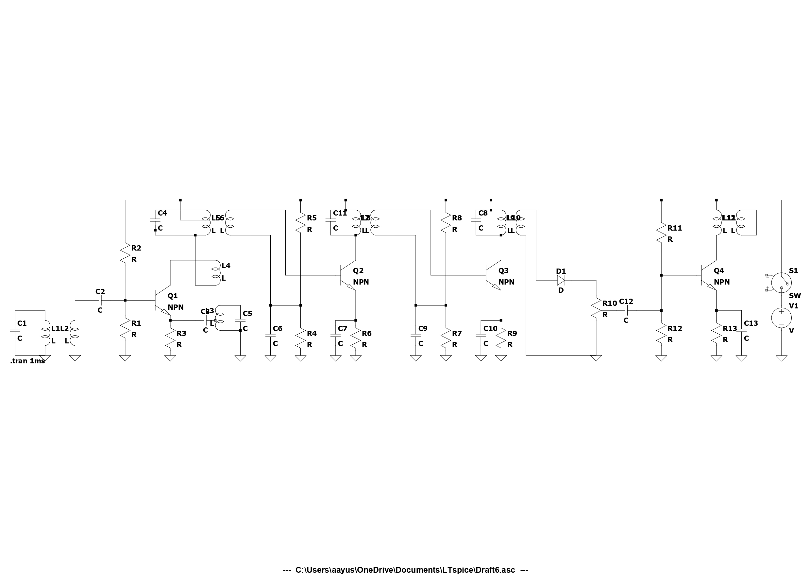
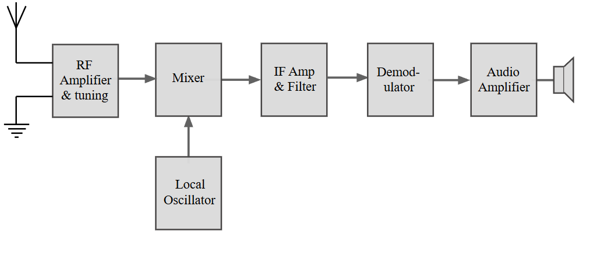
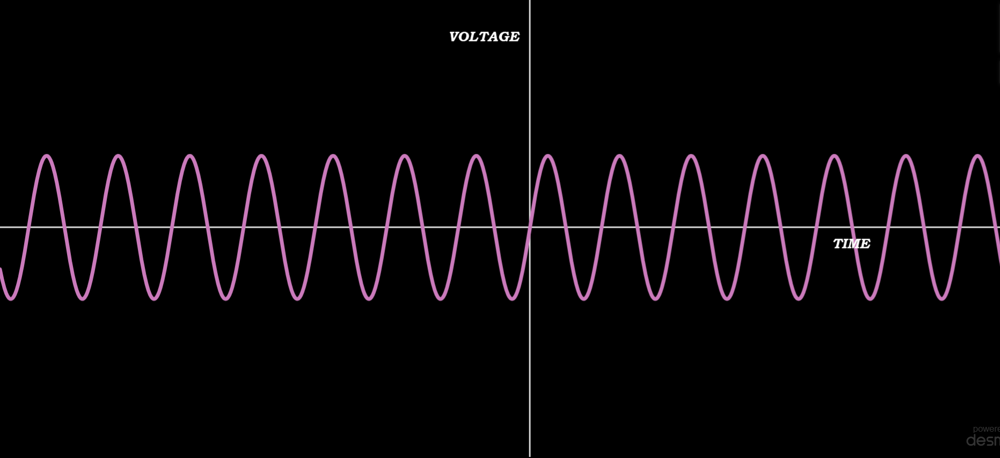
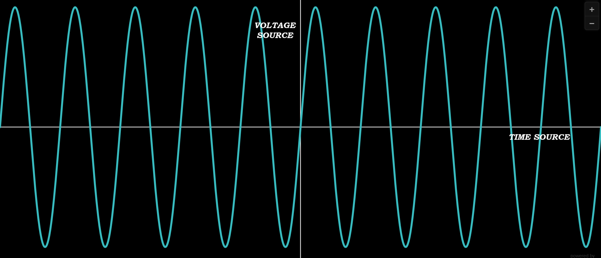
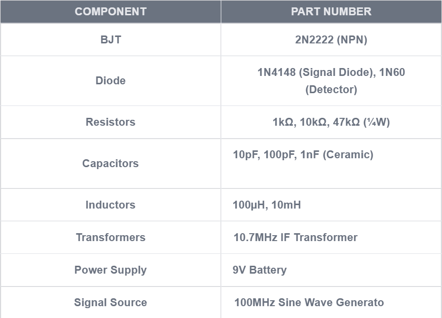

# **Superheterodyne Receiver Simulation in LTSpice**

## **Overview**
This project simulates a **Superheterodyne Receiver** using **LTSpice**. The receiver consists of multiple stages, including an **RF Amplifier, Mixer, Local Oscillator, IF Amplifier, and Detector**, to process and extract signals from a high-frequency RF input.

---

## **Circuit Diagram**
The full circuit designed in LTSpice is shown below:

---

## **Block Diagram**
The receiver is divided into the following stages:

1. **RF Amplifier** – Amplifies the weak input RF signal.
2. **Mixer & Local Oscillator** – Converts the RF signal to an intermediate frequency (IF).
3. **IF Amplifier** – Further amplifies the IF signal.
4. **Detector & Audio Output** – Extracts the original modulated signal.

## **Input Waveform**
The input RF signal is a high-frequency sine wave:

---

## **Output Waveform**
The final detected signal output:

---

## **Component List**
Below are the components used in the circuit:

---

## **How to Run the Simulation**
1. **Open LTSpice** and load the provided circuit file (`receiver.asc`).
2. Run the **Transient Analysis** with the following settings:
   - Stop Time: **1 ms**
   - Max Timestep: **1 ns**
3. Observe the waveforms at different nodes to verify circuit operation.

---

## **Conclusion**
This project successfully demonstrates the working of a **Superheterodyne Receiver** in LTSpice. The simulation showcases the importance of **RF amplification, frequency conversion, and demodulation** in signal processing.
